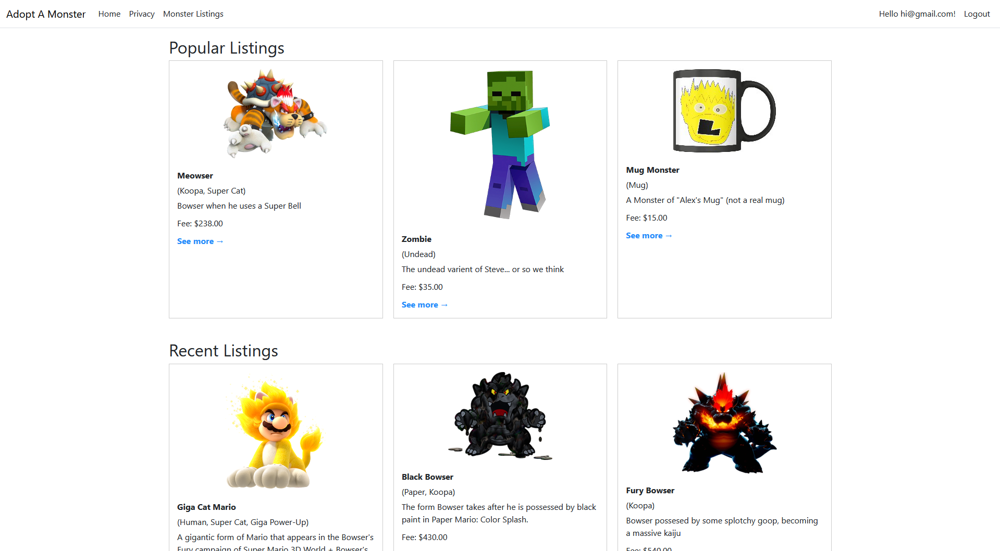

# AdoptAMonsterSite [(Try the online site here)](https://adoptamonster-alex-f2awgzayfcaxd7d8.canadacentral-01.azurewebsites.net/)

This website allows visitors to create user accounts, create monsters, view monster listings, 
and adopt their own monster or two. 

The monsters that the user will be able to adopt are based in the horror genre whether it be through books, movies, or games, just as a way to further connect with certain pop culture monsters.

There will also be various activities for the user to perform with their monster in the near future as the website takes shape.

## Database Information
- Using ASP.NET Core Identity for the user data
- Using SQL Server for the database
- Using SkiaSharp for the image resizing and saving.

## Getting started
- [.NET 9.0](https://dotnet.microsoft.com/en-us/download/dotnet/9.0)
- [Visual Studio 2022+](https://visualstudio.microsoft.com/downloads/)
- [SQL Server](https://www.microsoft.com/en-us/sql-server/sql-server-downloads)

### Setup Instructions
1. Clone the repo
2. Apply migrations using package manager console
3. Run the application

## Contributers
- [Alex Fischer](https://github.com/SuperGamer001)
- [ToastedToast00](https://github.com/ToastedToast00)
- [Logan Nelson](https://github.com/logprogrammer92)
